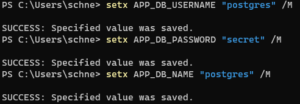

# Exercise 02 - Martin Schneglberger - S1810455022

## Part 1: Tutorial

Used Tutorial: https://semaphoreci.com/community/tutorials/building-and-testing-a-rest-api-in-go-with-gorilla-mux-and-postgresql

Run postgeSQL via docker:

`docker run -d -p 5432:5432 --name postgres -e POSTGRES_PASSWORD=secret -e POSTGRES_USER=postgres postgres`

Using the POSTGRES_PASSWORD environment variable the password can be set
I lost some time here as per default the ports are not mapped.

In order to connect to my database (via an UI), I use DBeaver

https://dbeaver.io/

Download and install go from here:

https://golang.org/doc/install?download=go1.14.3.windows-amd64.msi

IDE:

- Either GoLand by JetBrains
- Or plugin for VS Code (I chose this, as I did not want to bloat my laptop with another IDE) -> https://code.visualstudio.com/docs/languages/go

Init Go modules:

`go mod init github.com/schnegl/go_product_api.git`

Fetching requeired Go modules:

```
// HTTP Router and URL matcher to create the endpoint. Similar to *express* in Node.js
go get -u github.com/gorilla/mux

// Connector for postgres
go get -u github.com/lib/pq
```

Set environment variables:



*Attention*: Even though the environment variables were set correctly, Windows required me to log out and in again in order for Go to be able to read them
=> https://stackoverflow.com/questions/48131439/unable-to-receive-environment-variables-in-golang-and-windows-10

I like how this tutorial is organized in a way to promote test-driven-development

One thing I question at this point is if it is a good idea to run the tests against the same database as the API, but lets see if this will be handled later on.

For `app.go` I always had this lint-warning:

*exported type App should have comment or be unexportedgo-lint*

In order to fix this, just add a comment above the exported method in order to be style-conform.
This comment has to be in this format:

```
// Point Explanation for the point struct
type Point struct {
    X,Y int
}
```

When implementing the `getProducts()` method which uses OFFSET and LIMIT for pagination, I immediatelly had to think of this:  
https://use-the-index-luke.com/no-offset

Also, I think that `products` is not the right name for a SQL table, as those names should not be plural.
Additionally, this part in the TestUpdateProduct function does not really make sense:
```
if m["name"] == originalProduct["name"] {
		t.Errorf("Expected the name to change from '%v' to '%v'. Got '%v'", originalProduct["name"], m["name"], m["name"])
	}
```
In case those members are the same, the error message does not help anything in terms of telling us what is expected and what is actual.

I like how Gorilla Mux allows us to specify that the id should by numeric by using regex

### Result:


## Own features

### Feature 1 - Order 66 (I hope you saw Star Wars Episode III)


Idea Order 66: Treat all products as traits and thus eliminate / delete them by dropping the whole table.  
Order 66 should be executed when sending a *Delete* request to `/order/66`.   
Afterwards, all requests to find, update or insert any product will end in an internal server error as the tables are only created upon (test) initialization  

Tests for the order 66:

```
func TestOrder66(t *testing.T) {
	clearTable()
	addProducts(4)

	req, _ := http.NewRequest("GET", "/product/1", nil)
	response := executeRequest(req)
	checkResponseCode(t, http.StatusOK, response.Code)

	req, _ = http.NewRequest("DELETE", "/order/55", nil)
	response = executeRequest(req)

	checkResponseCode(t, http.StatusNotFound, response.Code)

	req, _ = http.NewRequest("DELETE", "/order/66", nil)
	response = executeRequest(req)

	checkResponseCode(t, http.StatusOK, response.Code)
	var m map[string]string
	json.Unmarshal(response.Body.Bytes(), &m)
	//TODO: Very bad practice to check responses like this. Hierarchy withing clone troopers change as well, what if Commander Cody gets ousted?
	if m["result"] != "Order66 excuted. Commander Cody over and out." { 
		t.Errorf("Expected the order to be executed by Commander Cody only. Got '%s'", m["error"])
	}

	req, _ = http.NewRequest("GET", "/product/1", nil)
	response = executeRequest(req)
	checkResponseCode(t, http.StatusInternalServerError, response.Code)

}
```

Add this to `model.go`:

```
func dropProductsTable(db *sql.DB) error {
	_, err := db.Exec("DROP TABLE products")

	if err != nil {
		return err
	}

	return nil
}
```

`app.go`
```
// executeOrder66 Executes Order66 on this API
func (a *App) executeOrder66(w http.ResponseWriter, r *http.Request) {
	err := dropProductsTable(a.DB)

	if err != nil {
		respondWithError(w, http.StatusBadRequest, "Could not execute Order66. Traitors alive.")
	}

	respondWithJSON(w, http.StatusOK, map[string]string{"result": "Order66 excuted. Commander Cody over and out."})
}

// initializeRoutes Initializes the routes of the app
func (a *App) initializeRoutes() {
	//...
	a.Router.HandleFunc("/order/66", a.executeOrder66).Methods("DELETE")
}
```

Any tests run after this one will still succeed as the table gets initialized for every request.

### Feature 2 - Update price only (Or: *A New Hope* for something more serious)

Idea: Using a PATCH request to update a single field of an product only.

Changes `model.go`:

```
func updateProductField(db *sql.DB, id int, fieldName string, value interface{}) error {
	_, err :=
		db.Exec("UPDATE products SET $2=$3 WHERE id=$1", id, fieldName, value)

	return err
}
```

`app.go`:

```
// updateField Updates a single field of a product
func (a *App) updateField(w http.ResponseWriter, r *http.Request) {
	vars := mux.Vars(r)
	id, err := strconv.Atoi(vars["id"])
	if err != nil {
		respondWithError(w, http.StatusBadRequest, "Invalid product ID")
		return
	}
	fieldName := vars["field"]
	newValue := vars["value"]

	if err := updateProductField(a.DB, id, fieldName, newValue); err != nil {
		respondWithError(w, http.StatusInternalServerError, err.Error())
		return
	}

	respondWithJSON(w, http.StatusOK, map[string]string{"result": "success"})
}

// initializeRoutes Initializes the routes of the app
func (a *App) initializeRoutes() {
    //...
	a.Router.HandleFunc("/product/{id:[0-9]+}/{field}/{value}", a.updateField).Methods("PATCH")
	//...
}
```

`main_test.go`:

```
func TestUpdateSingleField(t *testing.T) {

	clearTable()
	addProducts(1)

	req, _ := http.NewRequest("GET", "/product/1", nil)
	response := executeRequest(req)
	var originalProduct map[string]interface{}
	json.Unmarshal(response.Body.Bytes(), &originalProduct)

	req, _ = http.NewRequest("PATCH", "/product/1/price/10", nil)
	response = executeRequest(req)

	checkResponseCode(t, http.StatusOK, response.Code)

	req, _ = http.NewRequest("PATCH", "/product/1/name/Commander", nil)
	response = executeRequest(req)

	checkResponseCode(t, http.StatusOK, response.Code)

	req, _ = http.NewRequest("GET", "/product/1", nil)
	response = executeRequest(req)
	var updatedProduct map[string]interface{}
	json.Unmarshal(response.Body.Bytes(), &updatedProduct)

	if updatedProduct["id"] != originalProduct["id"] {
		t.Errorf("Expected the id to remain the same (%v). Got %v", originalProduct["id"], updatedProduct["id"])
	}

	if updatedProduct["name"] == originalProduct["name"] {
		t.Errorf("Expected the name to change from '%v'", originalProduct["name"])
	}

	if updatedProduct["price"] == originalProduct["price"] {
		t.Errorf("Expected the price to change from '%v'", originalProduct["price"])
	}
}
```

This always resulted in this error:

```
panic: runtime error: invalid memory address or nil pointer dereference [recovered]
	panic: runtime error: invalid memory address or nil pointer dereference
```

After searching for a while, I found this link: https://medium.com/easyread/http-patch-method-ive-thought-the-wrong-way-c62ad281cb8

Which basically stated that I do not use the PATCH request the correct way. As I do not pass any body but `nil` and keep the params in the url, this leads to the error stated above.
What I should do instead is sending a request similar to this format:

```
PATCH /product/{id}
[
  { "op": "replace", "path": "/name", "value": "newName" }
]
```

**Learning:** Apparently, I did not know what the patch request RFC standard looks like

**Fix:** 
As any field should be updateable, implementing this would be quite complex as also different operations can be specified. 


There are quite a few libraries helping to create patch endpoints and their logic:
https://github.com/evanphx/json-patch#create-and-apply-a-merge-patch


### Result:


### Meme to brighten your day
